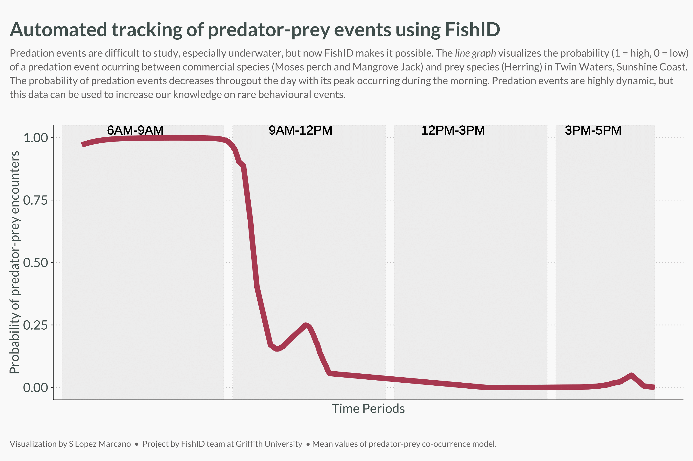
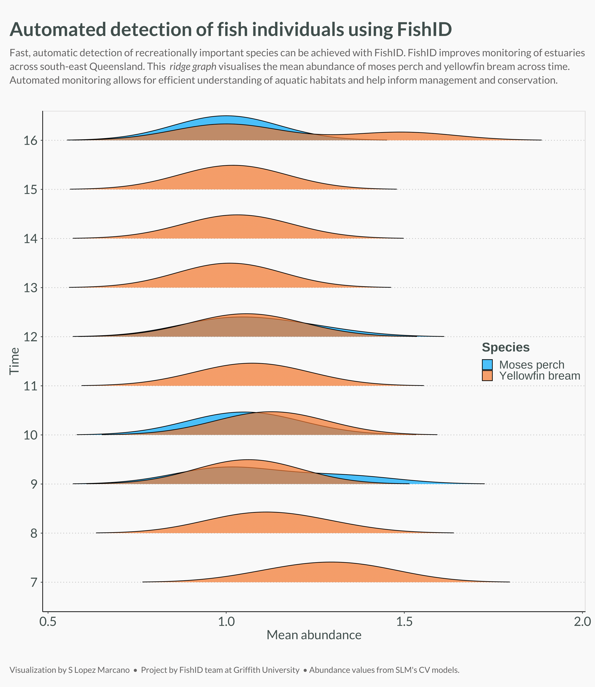
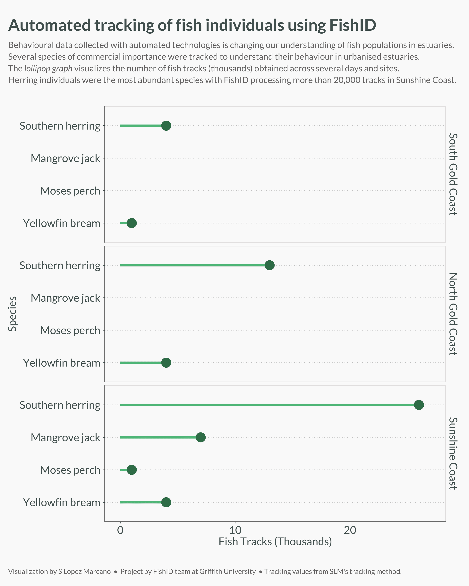

# Moreton Bay Live and Play Together
[Living and Playing Together](https://moretonbayfoundation.org/research/living-and-playing-together/), is a project supported by the Moreton Bay Foundation. FishID and Griffith University supported this project by producing this repo that includes visualisations of some southeast Queensland projects using Artificial Intelligence. 

---------

## 🦈 Predator - prey encounters
Dyring my PhD, I developed a predator-prey co-occurrence model using computer vision fish tracking data. A computer vision model trained with thousands of annotations and images of commercial and recreationally important fish in urbanised estuaries. The sampling sites included North and South Gold Coast and Twin Waters in Sunshine Coast; all in southeast Queensland, Australia. 

The predator-prey co-ocurrence model was used to understand potential temporal clusters of predator-prey events and or interactions. For Twin Waters, the model showed that morning periods have high probabilities of these interactions occurring. The probability diminished sharply throughout the day. This data was then validated manually by assessing the videos collected in the study site. 

*In addition to these ecological findings, this study demonstrated how powerful automated processing of underwater data is for environmental monitoring and ecology*. 

## 🐡Fish abundance through time
Computer vision and automated data processing can also give us how abundance changes temporally. I monitored two species that in southeast Queensland are heavily fished and consumed (Moses Perch and Yellowfin bream).

## 📈 How many fish were tracked by the cameras?
Computer vision can also detect many fish in a robust and accurate manner. My tracking dataset demonstrated that thousands of fish (especially Herring) swam and were tracked with our cameras and the computer vision models. More than 20,000 herring tracks were produced by our model across all sampling days. 

